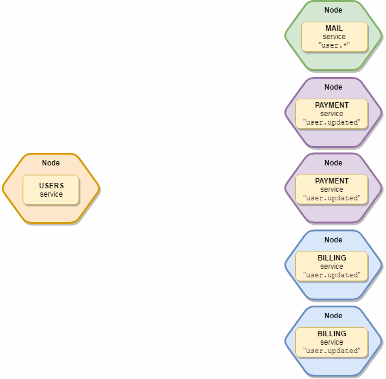

# Events

Steedos has a built-in event bus to support [Event-driven architecture](http://microservices.io/patterns/data/event-driven-architecture.html) and to send events to local and remote services. 

:::tip
Please note that built-in events are fire-and-forget meaning that if the service is offline, the event will be lost.
:::

### Balanced events
The event listeners are arranged to logical groups. It means that only one listener is triggered in every group.

> **Example:** you have 2 main services: `users` & `payments`. Both subscribe to the `user.created` event. You start 3 instances of `users` service and 2 instances of `payments` service. When you emit the `user.created` event, only one `users` and one `payments` service instance will receive the event.


The group name comes from the service name, but it can be overwritten in event definition in services.

**Example**
```js
module.exports = {
    name: "payment",
    events: {
        "order.created": {
            // Register handler to the "other" group instead of "payment" group.
            group: "other",
            handler(ctx) {
                console.log("Payload:", ctx.params);
                console.log("Sender:", ctx.nodeID);
                console.log("Metadata:", ctx.meta);
                console.log("The called event name:", ctx.eventName);
            }
        }
    }
}
```

### Emit balanced events
Send balanced events with `broker.emit` function. The first parameter is the name of the event, the second parameter is the payload. 
_To send multiple values, wrap them into an `Object`._

```js
// The `user` will be serialized to transportation.
broker.emit("user.created", user);
```

Specify which groups/services shall receive the event:
```js
// Only the `mail` & `payments` services receives it
broker.emit("user.created", user, ["mail", "payments"]);
```

## Broadcast event
The broadcast event is sent to all available local & remote services. It is not balanced, all service instances will receive it.



Send broadcast events with `broker.broadcast` method.
```js
broker.broadcast("config.changed", config);
```

Specify which groups/services shall receive the event:
```js
// Send to all "mail" service instances
broker.broadcast("user.created", { user }, "mail");

// Send to all "user" & "purchase" service instances.
broker.broadcast("user.created", { user }, ["user", "purchase"]);
```

### Local broadcast event
Send broadcast events only to all local services with `broker.broadcastLocal` method.
```js
broker.broadcastLocal("config.changed", config);
```

## Subscribe to events

Event context is useful if you are using event-driven architecture and want to trace your events. The Event Context is very similar to Action Context, except for a few new event related properties. 

```js
module.exports = {
    name: "accounts",
    events: {
        "user.created"(ctx) {
            console.log("Payload:", ctx.params);
            console.log("Sender:", ctx.nodeID);
            console.log("Metadata:", ctx.meta);
            console.log("The called event name:", ctx.eventName);

            ctx.emit("accounts.created", { user: ctx.params.user });
        },

        "user.removed": {
            // Force to use context based signature
            context: true,
            handler(other) {
                console.log(`${this.broker.nodeID}:${this.fullName}: Event '${other.eventName}' received. Payload:`, other.params, other.meta);
            }
        }
    }
};
```


Subscribe to events in 'events' property of services. Use of wildcards (`?`, `*`, `**`) is available in event names.

```js
module.exports = {
    events: {
        // Subscribe to `user.created` event
        "user.created"(ctx) {
            console.log("User created:", ctx.params);
        },

        // Subscribe to all `user` events, e.g. "user.created", or "user.removed"
        "user.*"(ctx) {
            console.log("User event:", ctx.params);
        }
        // Subscribe to every events
        // Legacy event handler signature with context
        "**"(payload, sender, event, ctx) {
            console.log(`Event '${event}' received from ${sender} node:`, payload);
        }
    }
}
```

### Event parameter validation

Similar to action parameter validation, the event parameter validation is supported.
Like in action definition, you should define `params` in event definition and the built-in `Validator` validates the parameters in events.

```js
// mailer.service.js
module.exports = {
    name: "mailer",
    events: {
        "send.mail": {
            // Validation schema
            params: {
                from: "string|optional",
                to: "email",
                subject: "string"
            },
            handler(ctx) {
                this.logger.info("Event received, parameters OK!", ctx.params);
            }
        }
    }
};
```
>The validation errors are not sent back to the caller, they are logged or you can catch them with global error handler.

## System events
The broker broadcasts some internal events. These events always starts with `$` prefix.

### `$services.changed`
The broker sends this event if the local node or a remote node loads or destroys services.

**Payload**

| Name | Type | Description |
| ---- | ---- | ----------- |
| `localService ` | `Boolean` | True if a local service changed. |

**Payload**

| Name | Type | Description |
| ---- | ---- | ----------- |
| `node` | `Node` | Node info object |
| `unexpected` | `Boolean` | `true` - Not received heartbeat, `false` - Received `DISCONNECT` message from node. |

## Object events

When data in a business object changes, Steedos automatically emits an event. You can subscribe to these events in your code to handle relevant business logic.
