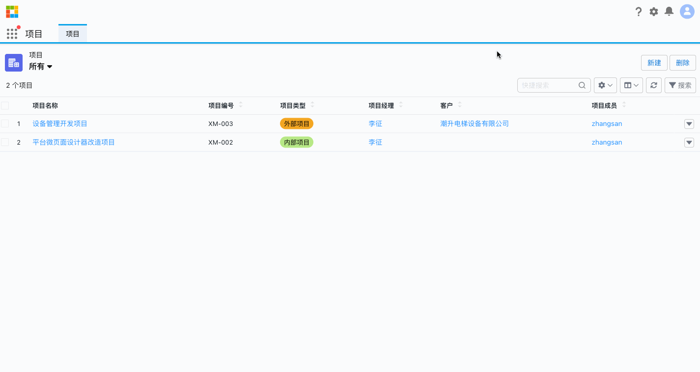
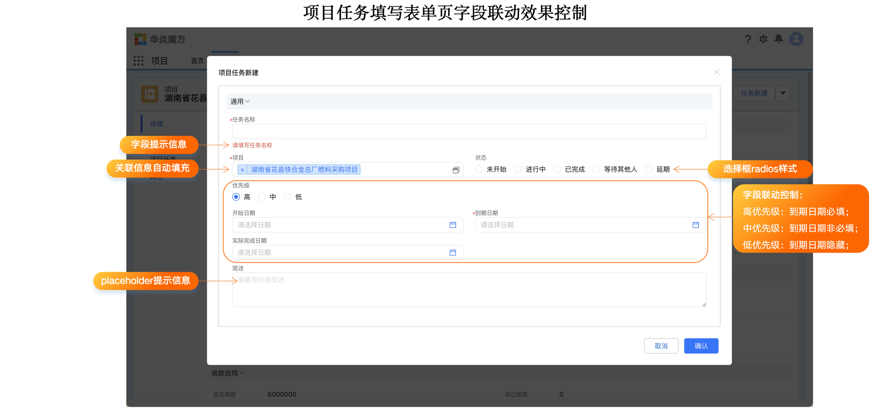

Steedos 表单设计器是一种可视化工具，用于在 Steedos 平台上设计和创建业务表单。它的主要功能是简化表单设计过程，使用户能够无需编程知识就能创建复杂的表单结构。这对于需要快速构建和调整业务表单的企业来说非常有用。

- **可视化界面**：表单设计器提供了直观的拖放界面，用户可以轻松添加、移除或调整表单组件。这种设计方式降低了表单设计的技术门槛。

- **丰富的表单组件**：Steedos 表单设计器提供了多种表单组件，如文本框、下拉菜单、日期选择器、单选/多选框等，满足不同类型的表单需求。

- **自定义字段**：支持自定义字段的创建，用户可以根据业务需求添加自定义字段，并设置字段的属性和验证规则。

- **字段联动**：允许用户设置字段间的联动关系，使表单具备动态响应能力。例如，根据用户的选择动态显示或隐藏特定字段。

- **验证规则**：提供多种字段验证规则，如必填、唯一性、正则表达式等，确保表单数据的准确性和规范性。

- **字段权限**：支持字段级权限控制，用户可以为不同角色或用户组设置字段的可见性和编辑权限，确保数据的安全和隐私。

- **表单布局设计**：用户可以自定义表单的布局，包括字段排列方式、表单分组等。这种灵活的设计方式有助于创建符合业务逻辑的表单。

- **数据绑定**：Steedos 表单设计器支持与业务数据的绑定，用户可以轻松将表单与业务对象关联，实现数据的增删改查。

Steedos 表单设计器旨在简化表单设计流程，为企业提供一种快速、高效的表单构建方式。通过使用这个工具，企业可以减少开发时间，提升业务效率，确保数据的一致性和准确性。

### 设计字段布局

华炎魔方的对象设计字段布局功能为用户提供了灵活而直观的界面设计工具，使其能够轻松地定制和优化数据录入界面。通过该功能，用户可以根据实际需求，自由调整对象表单中各个字段的布局和显示顺序，以及设置字段的可见性和必填性等属性。这样的设计自由度不仅有助于提升用户体验和操作效率，还能够根据不同角色或场景定制不同的表单布局，满足各种复杂业务需求。

### 自动填充
华炎魔方的对象表单自动填充功能是一项极具便利性和效率的特性，为用户提供了一种智能化的数据输入方式。通过该功能，用户在填写表单时，系统可以根据之前输入的数据或者设定的规则，自动填充相关字段，同时可以通过字段属性控制自动带出字段只读和可编辑属性，从而节省用户的时间和精力。无论是在快速创建新记录、提高数据输入准确性，还是简化重复性工作方面，对象表单自动填充功能都能够使用户在数据填写更加高效和便捷。

### 动态显隐

华炎魔方的字段动态显隐功能为用户提供了一个智能化的界面设计工具，使其能够根据特定条件动态控制字段或详情页相关表的显示与隐藏。通过该功能，用户可以根据不同的业务逻辑或用户角色，动态地设置可见性，从而简化表单界面，使其更加清晰和易于操作。这一功能不仅提高了用户界面的灵活性和定制性，还可以根据实际需求动态地调整数据录入界面，减少了用户的操作复杂度，提升了工作效率。

### amis自定义字段

使用AMis自定义字段功能，用户可以根据自身业务需求，轻松地添加、调整和配置各种自定义字段，包括文本、数字、日期等多种类型。这使得用户可以根据特定的业务场景，自由设计和构建符合实际需求的数据录入界面，提高了界面的灵活性和适用性。AMis自定义字段功能不仅简化了界面开发流程，还为用户提供了更加个性化和专业化的界面定制方案，为数据管理提供了更高水平的支持。

### amis自定义表单

使用AMis自定义表单功能，用户可以轻松地添加、删除、调整和配置表单中的各种字段和控件，以及定义数据校验规则和业务逻辑，从而实现个性化的数据录入界面。这一功能不仅提高了用户的操作灵活性和效率，还能够满足不同业务场景下的定制化需求，为用户提供更加专业和便捷的数据管理解决方案。

### 验证规则

在华炎魔方平台中，数据验证规则功能是一个显著的亮点。该功能允许用户定义和配置各种数据验证规则，以确保用户在新建或者编辑数据时的准确性。通过数据验证规则，用户可以在数据保存之前对其进行验证，以确保符合预期的业务逻辑和规范。当数据不符合规则时，系统会自动触发警告或阻止保存，提供实时的数据质量保障。这一功能使得数据在录入和管理过程中更加可靠，减少了错误和不一致性，从而提高了工作效率和数据质量。

比如：用户可以创建验证规则，使得每一个“业务机会”的“金额”数值必须大于1000，否则拒绝保存。验证规则适用于对象被添加或更改的所有场景。

